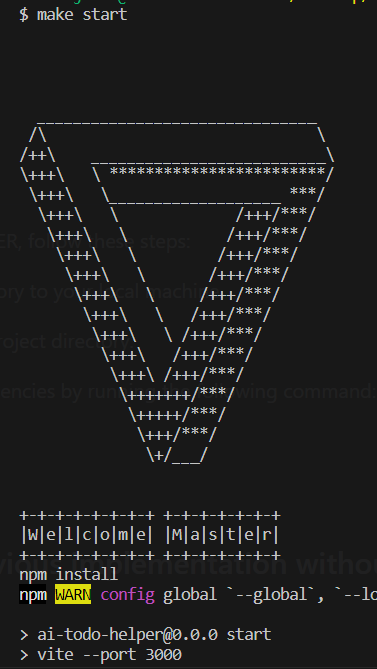

# AI-TODO-HELPER

[](https://opensource.org/licenses/MIT)

AI-TODO-HELPER is a powerful task management tool that leverages the OpenAI GPT-3.5 Turbo model to assist you in breaking down tasks into smaller subtasks. With the help of AI and Framer Motion libary , you can easily split your tasks and generate a visual representation of the subtasks with captivating animations, enhancing the overall visual experience. By utilizing perceived performance techniques, we have ensured exceptional user experience, making the AI-TODO-HELPER interface smooth.

## Table of Contents

- [Installation](#installation)
- [TODO](#todo)
  - [WebApp](#webapp)
  - [API](#api)
  - [Visionary](#very-optimistic-visionary-plan)

## Installation

To use AI-TODO-HELPER, follow these steps:

1. Clone this repository to your local machine.
2. Navigate to the project directory.
3. Install the dependencies by running the following command:

   ```shell
   npm install
   npm start 
   ```

   Or if your shell has make commands configured you can run the following command (linux & mac users have it by default):

   ```
   make start
   ```
    If you do you will get this cool ascii art in your terminal.

    
    
   
## This is the previous implementation without setting up a proxy middleware


# TODO

This is the roadmap for the future development of our project.

## Planned Features


### WebApp

- Resolve and optimize the requests made to the OpenAI API to ensure smooth and reliable functionality.
- When the user creates a todo it will open a pop-up where he sets the duration of this task.
- Implement necessary routes for seamless navigation within the application.
  - `/create-todo`: Integrate an image slider that allows users to create todos with visual representation.
  - `/calendar`: Develop a calendar view where users can set and manage todos in a convenient and organized manner .
- Calendar component 
    - This will be a grid where the years represents the rows and the months and the columns the months 
    - Below this grid it should be a row that slides on x-axis with cards of all available todos that arent already set.
        - User grabs todos from the todo list below the grid and drags them to the calendar.
        - When the user finds the correct year and month he wants he holds there for 3 seconds and the cell where the current card is hovering to will exapnd into a as big grid ass a current one.
        - This new grid where the rows will be replaced by the days of the month the user chose to hover on the previous grid and the columns will represent the hours of that day.
        - While the user keeps the card hovered above a cell the x-axe will change the colour to a sligth purple(maybe) and the y-axe of that cell also.
        -When the user drops the card in the hour he wants the card will take that as a starting hour and if the task is set to more than one hour it will expend after being droped and takes as meany hour cells as it needs.  


### API

- Connect it with hasura and make the appropriate backend to it.
- Make the authentication and the log in with the users.
- Make it possible to work on the same workspace with different people.
    - Make it with hasura GraphQL subscription events that hasura offers.
    - this will enable real time view and modifications on the same calendar for the group of users.

### Very Optimistic Visionary Plann

- Make this application work with: 
    - VR (Virtual Reality)
    - AR (Augmented Reality)


We are committed to continuously improving and expanding the functionality of our AI-TODO-HELPER application to provide an exceptional user experience. Stay tuned for updates and exciting new features!


```import { Configuration, OpenAIApi } from "openai";
import { useState } from "react";

const useChatGPT = () => {
  const [userInput, setUserInput] = useState("");

  const [aiResponse, setAiResponse] = useState(null);
  const [aiImages, setAiImages] = useState(null);
  const [loading, setLoading] = useState(false);


  //Prepare the configuration
  const configuration = new Configuration({
    apiKey: import.meta.env.VITE_SUBTASK_KEY,
    organization: import.meta.env.VITE_ORGANIZATION_ID
  });

  const imageConfiguration = new Configuration({
    apiKey: import.meta.env.VITE_IMAGE_GENERATOR_KEY,
    organization: import.meta.env.VITE_ORGANIZATION_ID
  });

  const openai = new OpenAIApi(configuration);
  const imageOpenAi = new OpenAIApi(imageConfiguration);

  // This function will trigger the request to the openAI API with the correct configuration and the right prompt from the user
  const aiGenerate = async (userInput) => {
    try {
      const completion = await openai.createChatCompletion({
        model: "gpt-3.5-turbo",
        messages: [
          {
            role: "user",
            content: `Split this in 5 smaller subtasks and put a $ after each subtask: ${userInput}`,
          },
        ],
      });

      const responseImage = await imageOpenAi.createImage({
        prompt: userInput,
        n: 5,
        size: "512x512",
      });

      setAiImages(responseImage.data.data);
      setAiResponse(completion.data.choices[0].message.content.split("$"));
      setLoading(false)
    } catch (error) {
      if (error.response) {
        const completion = error.response;
        console.log(completion)
      } else {
        const completion = error.message;
        console.log(completion);
      }
    }

  };

  const handleUserInput = (e) => setUserInput(e.target.value);


  //This will reset the loading state and call the ai generate function with the new input 
  const handleAiActivate = () => {
    setLoading(true);
    aiGenerate(userInput);
  };

  return {
    aiResponse,
    aiImages,
    userInput,
    loading,
    setLoading,
    handleUserInput,
    handleAiActivate,
  };
};

export default useChatGPT; 
```

### This is in the useChatGPT.js custom hook it works but we get an error that says: 

```unable to useChatGPT.js? Refused to set unsafe header "User-Agent"```

### Now we are going to use axios to make OPENAI SDK in order to fix the error but we are also going to set up a proxy server on our local development environment that forwards the requests to the OpenAI API. This way, the request will be made from our local server instead of the client-side, bypassing the CORS restrictions. 


### Fetching with axios didn't really work so the way i fixed it was by removing the  User_agent at all from the configuration object and imageConfiguration on the useChatGPT hook.
